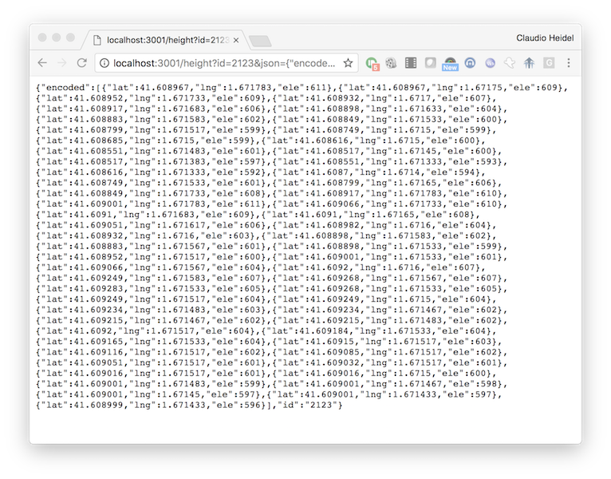

# elevation-service
Elevation API Service

run as

	./index.js

App is listening on port 3000

And then go to
 
	http://localhost:3000/ele?d=40.8501011,-3.9649810
	

Todo:
Add multi-coordinate request
Add Security Headers (JWT) and origin checker
